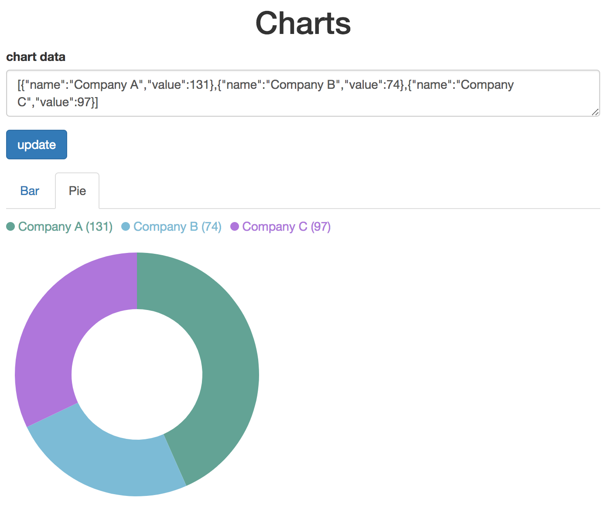

## chart
### 1. start the server
```
python -m server 8000
```
after server has been started, you can open http://localhost:8000/ to view the chart.




you can update the json data inside the textarea to update the chart.

### 2. development
for development, you need to run webpack task.
first, install all the dependencies
```
npm i
```
second, run webpack task
```
npm run build
```